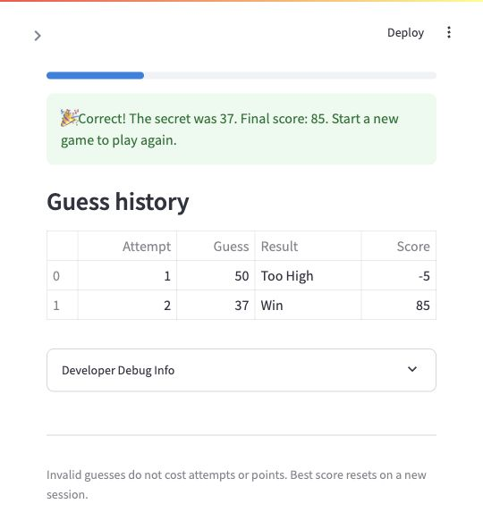

# 🎮 Game Glitch Investigator

A Streamlit number guessing game repaired with ChatGPT Codex. Choose a difficulty,
submit whole-number guesses, and use higher/lower hints to find the secret before
running out of attempts.

## Setup and run

Run these commands from the repository directory:

```bash
python3 -m venv .venv
source .venv/bin/activate
python -m pip install --upgrade pip
python -m pip install -r requirements.txt
python -m streamlit run app.py
```

Open http://localhost:8501 and keep the terminal running. Stop the server with
Ctrl+C. The project was verified with Python 3.8.2 and Streamlit 1.40.1.
If an older installer tries building dependencies from source, upgrade pip first;
`python -m pip install --only-binary=:all: -r requirements.txt` can require prebuilt
packages. Streamlit 1.32 or newer is required for the form and test APIs used here.

## Rules

| Difficulty | Number range | Valid guesses allowed |
|---|---|---|
| Easy | 1–20 | 6 |
| Normal | 1–100 | 8 |
| Hard | 1–50 | 5 |

The starter's difficulty ranges are preserved. Wrong guesses cost five points.
A win awards 100 points on the first valid attempt, decreasing by ten for each
extra attempt, with a minimum award of ten. The award is added to the round score,
including any previous penalties. Empty, nonnumeric, decimal, and out-of-range
inputs cost neither attempts nor points. A final-attempt correct guess wins.
Changing difficulty or pressing **New Game** resets the round. The best winning
score survives new rounds within the same browser session; it is not saved to disk.

## Bugs found and fixes

| Starter issue | Cause | Repair |
|---|---|---|
| Higher/lower hints were reversed | Messages contradicted the numeric comparison in `check_guess`. | `logic_utils.check_guess` returns a string outcome; `app.HINTS` maps it to the correct direction. |
| Game ended after seven Normal guesses while showing one attempt left | Attempts began at 1, and the display was rendered before the increment. | Start at 0, count only valid guesses, and rerun before rendering updated counters. |
| `3.9` silently became `3` | `int(float(raw))` truncated decimal input. | `logic_utils.parse_guess` parses integers directly and rejects decimals. |
| Invalid guesses consumed attempts | Counter increment happened before validation. | Validate syntax and difficulty range before updating state. |
| New Game remained stuck after a win/loss | Reset omitted status, score, and history. | `app.reset_game` clears all round state and uses the selected difficulty's range. |
| Difficulty and reset could disagree about the secret's range | Existing secret persisted on difficulty changes; reset always chose 1–100. | Difficulty changes call `reset_game`, and both paths use `get_range_for_difficulty`. |
| Some wrong guesses earned points; win award was off by one | Scoring treated even Too High attempts differently and offset the attempt number. | Both wrong outcomes cost five; win points use a one-based valid-attempt count. |
| Comparison sometimes used strings | Secret was converted to text on alternate attempts, allowing lexicographic ordering. | Keep guesses and secrets as integers throughout the app. |
| All starter tests raised `NotImplementedError` | `logic_utils.py` contained placeholders. | Implement the pure functions and import them into the app; preserve the original three outcome tests. |

The secret already persisted between submissions in this starter version; the
original README's claim that it changed on every submit did not match the code.
The state bugs found here concerned counters, difficulty changes, and resets.

## Before-fix reproduction evidence

The actual starter UI was exercised using Streamlit AppTest. Its secret was set
to 50 to make the inputs repeatable. Full trace: [starter-session.txt](evidence/starter-session.txt).

```text
Initial display: Guess a number between 1 and 100. Attempts left: 7
Guess 60 / secret 50: 📈 Go HIGHER!
Guess 3.9: history = [60, 3]
After 7 guesses: Guess a number between 1 and 100. Attempts left: 1
Game over: Out of attempts! The secret was 50. Score: -25
New Game status: lost
New Game error: Game over. Start a new game to try again.
```

## Verified post-fix walkthrough

This session was played in the browser at localhost:8501, using Developer Debug
Info to verify the secret. Future games choose a random secret, so use your own
secret when repeating the winning step.

1. Select Normal and click **New Game**: the game shows eight attempts and a score of zero.
2. Expand **Developer Debug Info**: in this session the secret was 37.
3. Submit 50: the game says **Go LOWER!**, shows seven attempts left, and deducts five points.
4. Submit 37: the game reports a win with a final score of 85 and six attempts left.
5. Confirm the best score is 85, the history contains both guesses, and Submit is disabled.
6. Click **New Game** to play again; round state resets while the session's best score remains.
   Restart-after-win and restart-after-loss behavior are also verified by UI tests.

```text
POST-FIX BROWSER SESSION
Secret: 37
Guess 50 -> Too High / Go LOWER! / attempts left: 7 / score: -5
Guess 37 -> Win / attempts left: 6 / score: 85 / best score: 85
Submit Guess button disabled after winning.
```

Full trace: [fixed-session.txt](evidence/fixed-session.txt).



## Tests

With the virtual environment activated:

```bash
python -m pytest -q
```

Recorded output from the completed suite:

```text
......................................                                   [100%]
38 passed in 0.99s
```

- `tests/test_game_logic.py`: the three original winning/high/low outcome checks.
- `tests/test_edge_cases.py`: blank, decimal, nonnumeric, signed, and whitespace
  inputs; difficulty ranges; symmetric penalties; win award and minimum points.
- `tests/test_app.py`: actual Streamlit interactions, hint direction, secret
  persistence, invalid-input state preservation, full attempt budgets, final-try
  wins, win/loss restarts, difficulty changes, hidden hints, and best-score retention.

The UI tests use Streamlit AppTest and controlled secrets for deterministic checks;
these complement the real browser walkthrough. AI testing workflow and edge-case
rationales are recorded in [ai_interactions.md](ai_interactions.md).

## Completed stretch features

- **Advanced edge-case tests:** passing parametrized tests cover malformed inputs
  and boundaries, plus UI checks that invalid guesses leave round state unchanged.
- **Feature expansion via agent mode:** a session best winning score was added to
  `app.py`, with tests verifying it survives a reset and a lower-scoring later win.
- **Enhanced game UI:** score metrics, attempt progress, directional hints, and a
  structured guess-history table make the state visible. `reset_game` and the
  render section in `app.py` manage these features. Invalid guesses show clear
  errors, and completed rounds disable submission.

Professional linting and a two-model comparison were not attempted.
